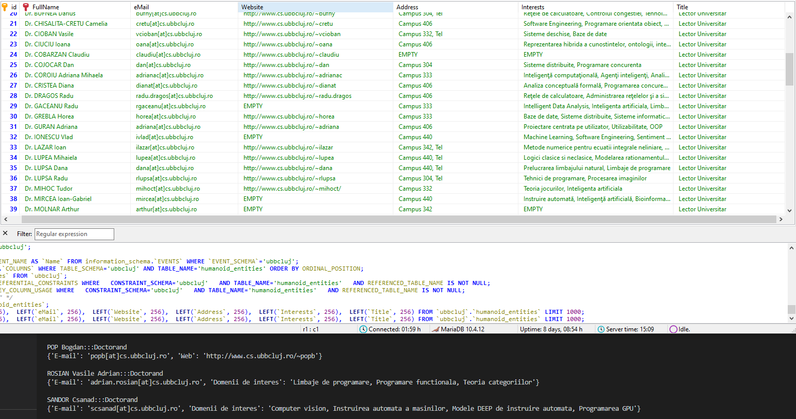

Data extracted from ubbcluj.ro

Use the embedding projector: [embedding projector:](https://projector.tensorflow.org/?config=https://raw.githubusercontent.com/p0licat/university/master/Experiments/Crawling/Jupyter%20Notebooks/template_projector_config.json)

